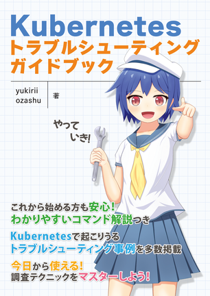

# 技術書典13「Kubernetes トラブルシューティング ガイドブック」

はじめまして [yukirii](https://github.com/yukirii) と [ozashu](https:/github.com/ozashu) です。

このリポジトリは、[技術書典13](https://techbookfest.org/)で頒布した「Kubernetes トラブルシューティング ガイドブック」のサポート用のリポジトリです。

電子書籍につきましては、技術書典公式オンラインマーケットや Booth にて PDF で入手可能です。

* 技術書典: https://techbookfest.org/product/aQ8jiENKVk0dw4ygMidfTC
* Booth: http://example.com/2
